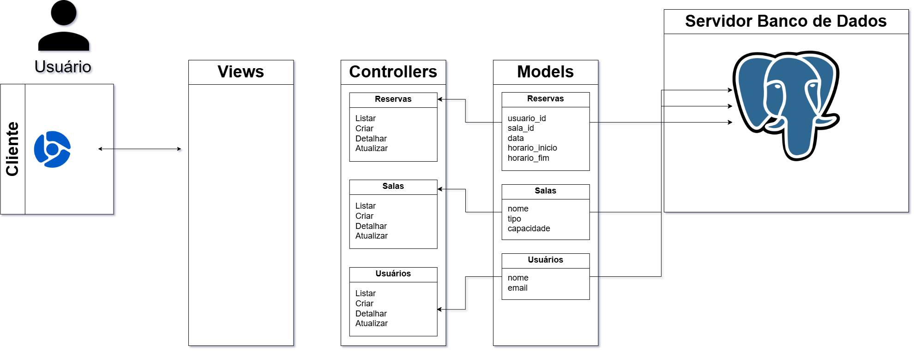

# Web Application Document - Projeto Individual - Módulo 2 - Inteli

**_Os trechos em itálico servem apenas como guia para o preenchimento da seção. Por esse motivo, não devem fazer parte da documentação final._**

## RoomReserve

#### Hugo Montan

## Sumário

1. [Introdução](#c1)  
2. [Visão Geral da Aplicação Web](#c2)  
3. [Projeto Técnico da Aplicação Web](#c3)  
4. [Desenvolvimento da Aplicação Web](#c4)  
5. [Referências](#c5)  

<br>

## <a name="c1"></a>1. Introdução (Semana 01)

RoomReserve é um sistema de reserva de salas acadêmicas que simplifica o agendamento de ateliês e salas de estudo. Com cadastro intuitivo de espaços, prevenção automática de conflitos de horários e consulta em tempo real, a plataforma oferece controle total sobre a disponibilidade dos ambientes.

---

## <a name="c2"></a>2. Visão Geral da Aplicação Web

### 2.1. Personas (Semana 01 - opcional)

*Posicione aqui sua(s) Persona(s) em forma de texto markdown com imagens, ou como imagem de template preenchido. Atualize esta seção ao longo do módulo se necessário.*

### 2.2. User Stories (Semana 01 - opcional)

*Posicione aqui a lista de User Stories levantadas para o projeto. Siga o template de User Stories e utilize a referência USXX para numeração (US01, US02, US03, ...). Indique todas as User Stories mapeadas, mesmo aquelas que não forem implementadas ao longo do projeto. Não se esqueça de explicar o INVEST de 1 User Storie prioritária.*

---

## <a name="c3"></a>3. Projeto da Aplicação Web

### 3.1. Modelagem do banco de dados  (Semana 3)


```
CREATE TABLE salas (
  id INTEGER PRIMARY KEY AUTOINCREMENT,
  nome TEXT NOT NULL,
  tipo TEXT NOT NULL,
  capacidade INTEGER NOT NULL
);

CREATE TABLE usuarios (
  id INTEGER PRIMARY KEY AUTOINCREMENT,
  nome TEXT NOT NULL,
  email TEXT NOT NULL UNIQUE
);

CREATE TABLE reservas (
  id INTEGER PRIMARY KEY AUTOINCREMENT,
  sala_id INTEGER NOT NULL,
  usuario_id INTEGER NOT NULL,
  data TEXT NOT NULL,
  horario_inicio TEXT NOT NULL,
  horario_fim TEXT NOT NULL,
  FOREIGN KEY (sala_id) REFERENCES salas(id),
  FOREIGN KEY (usuario_id) REFERENCES usuarios(id)
);
```

### 3.1.1 BD e Models (Semana 5)

## Salas

A tabela **`salas`** armazena informações sobre as salas disponíveis para reserva. Cada sala possui:

- **id**: Identificador único da sala (chave primária, autoincrementada).
- **nome**: Nome da sala (obrigatório).
- **tipo**: Tipo ou categoria da sala, como reunião, aula, etc. (obrigatório).
- **capacidade**: Capacidade máxima de pessoas que a sala comporta (obrigatório).

## Usuários

A tabela **`usuarios`** contém os dados dos usuários que podem realizar reservas:

- **id**: Identificador único do usuário (chave primária, autoincrementada).
- **nome**: Nome completo do usuário (obrigatório).
- **email**: Endereço de e-mail único do usuário (obrigatório e único).

## Reservas

A tabela **`reservas`** registra as reservas feitas pelos usuários para as salas. Os principais campos são:

- **id**: Identificador único da reserva (chave primária, autoincrementada).
- **sala_id**: Referência ao **id** da sala reservada (chave estrangeira).
- **usuario_id**: Referência ao **id** do usuário que fez a reserva (chave estrangeira).
- **data**: Data da reserva (obrigatório).
- **horario_inicio**: Horário de início da reserva (obrigatório).
- **horario_fim**: Horário de término da reserva (obrigatório).

### 3.2. Arquitetura (Semana 5)

Um diagrama de arquitetura representa visualmente a organização e a interação dos componentes de um sistema de software. Ele oferece uma visão clara da estrutura geral da aplicação, facilitando a compreensão do funcionamento do sistema antes mesmo de seu desenvolvimento. Essa representação é fundamental para o planejamento, documentação e comunicação entre desenvolvedores e demais stakeholders do projeto.

No contexto deste projeto, o diagrama foi utilizado para ilustrar as conexões entre models, views e controllers, destacando como esses elementos colaboram para manter o fluxo de informações e garantir a comunicação eficiente entre a interface do usuário e a lógica de negócio, conforme demonstrado a seguir:

**Instruções para criação do diagrama de arquitetura**  
- **Model**: A camada que lida com a lógica de negócios e interage com o banco de dados.
- **View**: A camada responsável pela interface de usuário.
- **Controller**: A camada que recebe as requisições, processa as ações e atualiza o modelo e a visualização.
  
*Adicione as setas e explicações sobre como os dados fluem entre o Model, Controller e View.*



### 3.3. Wireframes (Semana 03 - opcional)

*Posicione aqui as imagens do wireframe construído para sua solução e, opcionalmente, o link para acesso (mantenha o link sempre público para visualização).*

### 3.4. Guia de estilos (Semana 05 - opcional)

*Descreva aqui orientações gerais para o leitor sobre como utilizar os componentes do guia de estilos de sua solução.*


### 3.5. Protótipo de alta fidelidade (Semana 05 - opcional)

*Posicione aqui algumas imagens demonstrativas de seu protótipo de alta fidelidade e o link para acesso ao protótipo completo (mantenha o link sempre público para visualização).*

### 3.6. WebAPI e endpoints (Semana 05)

Usuários
### Usuários

| Método | Endpoint        | Descrição                 | Parâmetros / Corpo                                      |
|--------|-----------------|--------------------------|--------------------------------------------------------|
| POST   | /usuarios       | Criar novo usuário       | Corpo JSON: `{ nome, email, senha }`                   |
| GET    | /usuarios       | Listar todos os usuários | -                                                      |
| GET    | /usuarios/:id   | Buscar usuário por ID    | Parâmetro URL: `id`                                    |
| PUT    | /usuarios/:id   | Atualizar usuário        | Parâmetro URL: `id`<br>Corpo JSON: campos a atualizar |
| DELETE | /usuarios/:id   | Deletar usuário por ID   | Parâmetro URL: `id`                                    |

---

### Salas

| Método | Endpoint      | Descrição                | Parâmetros / Corpo                                      |
|--------|---------------|-------------------------|--------------------------------------------------------|
| POST   | /salas        | Criar nova sala         | Corpo JSON: `{ nome, tipo, capacidade }`               |
| GET    | /salas        | Listar todas as salas   | -                                                      |
| GET    | /salas/:id    | Buscar sala por ID      | Parâmetro URL: `id`                                    |
| PUT    | /salas/:id    | Atualizar sala          | Parâmetro URL: `id`<br>Corpo JSON: campos a atualizar |
| DELETE | /salas/:id    | Deletar sala por ID     | Parâmetro URL: `id`                                    |

---

### Reservas

| Método | Endpoint        | Descrição                 | Parâmetros / Corpo                                      |
|--------|-----------------|--------------------------|--------------------------------------------------------|
| POST   | /reservas       | Criar nova reserva       | Corpo JSON: `{ sala_id, usuario_id, data, horario_inicio, horario_fim }` |
| GET    | /reservas       | Listar todas as reservas | -                                                      |
| GET    | /reservas/:id   | Buscar reserva por ID    | Parâmetro URL: `id`                                    |
| PUT    | /reservas/:id   | Atualizar reserva        | Parâmetro URL: `id`<br>Corpo JSON: campos a atualizar |
| DELETE | /reservas/:id   | Deletar reserva por ID   | Parâmetro URL: `id`                                    |

---

### Eventos

| Método | Endpoint      | Descrição               | Parâmetros / Corpo                                      |
|--------|---------------|------------------------|--------------------------------------------------------|
| POST   | /eventos      | Criar novo evento      | Corpo JSON: `{ titulo, descricao, data, categoriaId }` |
| GET    | /eventos      | Listar todos os eventos | -                                                      |
| GET    | /eventos/:id  | Buscar evento por ID   | Parâmetro URL: `id`                                    |
| PUT    | /eventos/:id  | Atualizar evento       | Parâmetro URL: `id`<br>Corpo JSON: campos a atualizar |
| DELETE | /eventos/:id  | Deletar evento por ID  | Parâmetro URL: `id`                                    |

### 3.7 Interface e Navegação (Semana 07)

*Descreva e ilustre aqui o desenvolvimento do frontend do sistema web, explicando brevemente o que foi entregue em termos de código e sistema. Utilize prints de tela para ilustrar.*

---

## <a name="c4"></a>4. Desenvolvimento da Aplicação Web (Semana 8)

### 4.1 Demonstração do Sistema Web (Semana 8)

*VIDEO: Insira o link do vídeo demonstrativo nesta seção*
*Descreva e ilustre aqui o desenvolvimento do sistema web completo, explicando brevemente o que foi entregue em termos de código e sistema. Utilize prints de tela para ilustrar.*

### 4.2 Conclusões e Trabalhos Futuros (Semana 8)

*Indique pontos fortes e pontos a melhorar de maneira geral.*
*Relacione também quaisquer outras ideias que você tenha para melhorias futuras.*


## <a name="c5"></a>5. Referências

_Incluir as principais referências de seu projeto, para que o leitor possa consultar caso ele se interessar em aprofundar._<br>

---
---
