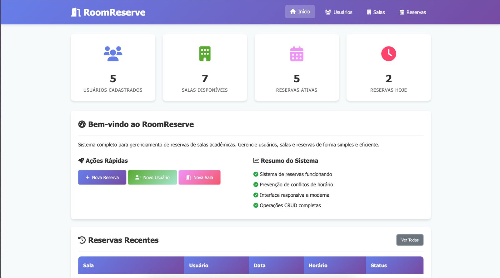
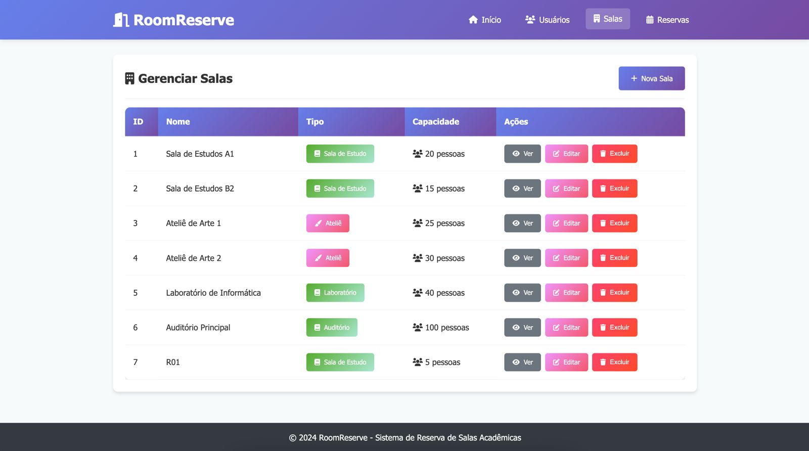
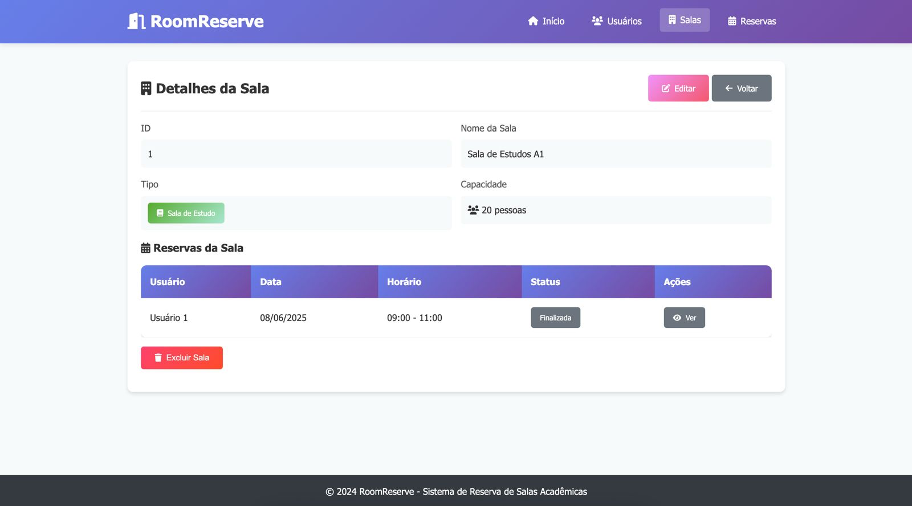
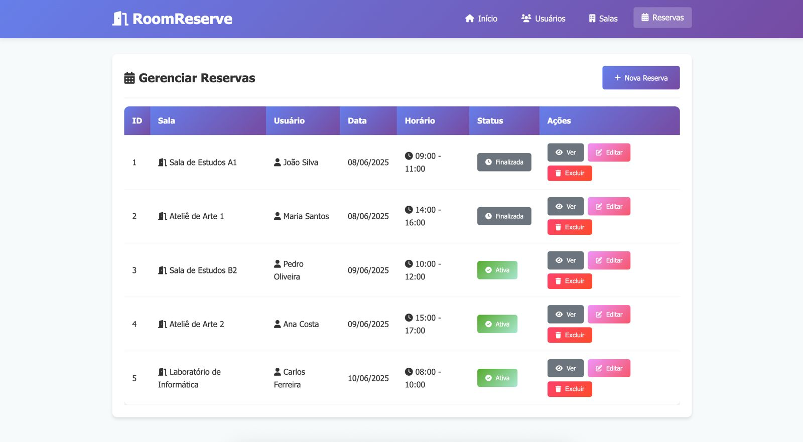

# Web Application Document - Projeto Individual - Módulo 2 - Inteli

## <i class="fas fa-door-open"></i> RoomReserve

#### Hugo Montan

## Sumário

1. [Introdução](#c1)  
2. [Visão Geral da Aplicação Web](#c2)  
3. [Projeto Técnico da Aplicação Web](#c3)  
4. [Desenvolvimento da Aplicação Web](#c4)  
5. [Referências](#c5)  

## <a name="c1"></a>1. Introdução

RoomReserve é um sistema de reserva de salas acadêmicas que simplifica o agendamento de ateliês e salas de estudo. Com cadastro intuitivo de espaços, prevenção automática de conflitos de horários e consulta em tempo real, a plataforma oferece controle total sobre a disponibilidade dos ambientes.

---

## <a name="c2"></a>2. Visão Geral da Aplicação Web

### 2.1. Personas (Semana 01 - opcional)

*Posicione aqui sua(s) Persona(s) em forma de texto markdown com imagens, ou como imagem de template preenchido. Atualize esta seção ao longo do módulo se necessário.*

### 2.2. User Stories (Semana 01 - opcional)

*Posicione aqui a lista de User Stories levantadas para o projeto. Siga o template de User Stories e utilize a referência USXX para numeração (US01, US02, US03, ...). Indique todas as User Stories mapeadas, mesmo aquelas que não forem implementadas ao longo do projeto. Não se esqueça de explicar o INVEST de 1 User Storie prioritária.*

---

## <a name="c3"></a>3. Projeto da Aplicação Web

### 3.1. Modelagem do banco de dados  (Semana 3)


```
DROP TABLE IF EXISTS reservas;
DROP TABLE IF EXISTS usuarios;
DROP TABLE IF EXISTS salas;

CREATE TABLE salas (
  id SERIAL PRIMARY KEY,
  nome VARCHAR(255) NOT NULL,
  tipo VARCHAR(100) NOT NULL,
  capacidade INTEGER NOT NULL
);

CREATE TABLE usuarios (
  id SERIAL PRIMARY KEY,
  nome VARCHAR(255) NOT NULL,
  email VARCHAR(255) NOT NULL UNIQUE
);

CREATE TABLE reservas (
  id SERIAL PRIMARY KEY,
  sala_id INTEGER NOT NULL,
  usuario_id INTEGER NOT NULL,
  data DATE NOT NULL,
  horario_inicio TIME NOT NULL,
  horario_fim TIME NOT NULL,
  FOREIGN KEY (sala_id) REFERENCES salas(id) ON DELETE CASCADE,
  FOREIGN KEY (usuario_id) REFERENCES usuarios(id) ON DELETE CASCADE
);

CREATE INDEX idx_reservas_sala_data ON reservas(sala_id, data);
CREATE INDEX idx_reservas_usuario ON reservas(usuario_id);
CREATE INDEX idx_usuarios_email ON usuarios(email);
```

### 3.1.1 BD e Models

## Salas

A tabela **`salas`** armazena informações sobre as salas disponíveis para reserva. Cada sala possui:

- **id**: Identificador único da sala (chave primária, autoincrementada).
- **nome**: Nome da sala (obrigatório).
- **tipo**: Tipo ou categoria da sala, como reunião, aula, etc. (obrigatório).
- **capacidade**: Capacidade máxima de pessoas que a sala comporta (obrigatório).

## Usuários

A tabela **`usuarios`** contém os dados dos usuários que podem realizar reservas:

- **id**: Identificador único do usuário (chave primária, autoincrementada).
- **nome**: Nome completo do usuário (obrigatório).
- **email**: Endereço de e-mail único do usuário (obrigatório e único).

## Reservas

A tabela **`reservas`** registra as reservas feitas pelos usuários para as salas. Os principais campos são:

- **id**: Identificador único da reserva (chave primária, autoincrementada).
- **sala_id**: Referência ao **id** da sala reservada (chave estrangeira).
- **usuario_id**: Referência ao **id** do usuário que fez a reserva (chave estrangeira).
- **data**: Data da reserva (obrigatório).
- **horario_inicio**: Horário de início da reserva (obrigatório).
- **horario_fim**: Horário de término da reserva (obrigatório).

### 3.2. Arquitetura

Um diagrama de arquitetura representa visualmente a organização e a interação dos componentes de um sistema de software. Ele oferece uma visão clara da estrutura geral da aplicação, facilitando a compreensão do funcionamento do sistema antes mesmo de seu desenvolvimento. Essa representação é fundamental para o planejamento, documentação e comunicação entre desenvolvedores e demais stakeholders do projeto.

No contexto deste projeto, o diagrama foi utilizado para ilustrar as conexões entre models, views e controllers, destacando como esses elementos colaboram para manter o fluxo de informações e garantir a comunicação eficiente entre a interface do usuário e a lógica de negócio, conforme demonstrado a seguir:

**Instruções para criação do diagrama de arquitetura**  

- **Model**: A camada que lida com a lógica de negócios e interage com o banco de dados.
- **View**: A camada responsável pela interface de usuário.
- **Controller**: A camada que recebe as requisições, processa as ações e atualiza o modelo e a visualização.


### 3.3. Wireframes (Semana 03 - opcional)

*Posicione aqui as imagens do wireframe construído para sua solução e, opcionalmente, o link para acesso (mantenha o link sempre público para visualização).*

### 3.4. Guia de estilos (Semana 05 - opcional)

_Descreva aqui orientações gerais para o leitor sobre como utilizar os componentes do guia de estilos de sua solução._

### 3.5. Protótipo de alta fidelidade (Semana 05 - opcional)

*Posicione aqui algumas imagens demonstrativas de seu protótipo de alta fidelidade e o link para acesso ao protótipo completo (mantenha o link sempre público para visualização).*

### 3.6. WebAPI e endpoints

### 3.6. WebAPI e endpoints (Semana 05)
A WebAPI do RoomReserve é projetada para fornecer uma interface consistente e segura para interagir com os dados do sistema. Ela segue os princípios RESTful, utilizando verbos HTTP para indicar as operações e códigos de status para indicar o resultado das requisições.

Usuários
### Usuários

| Método | Endpoint        | Descrição                 | Parâmetros / Corpo                                      |
|--------|-----------------|--------------------------|--------------------------------------------------------|
| POST   | /usuarios       | Criar novo usuário       | Corpo JSON: `{ nome, email, senha }`                   |
| GET    | /usuarios       | Listar todos os usuários | -                                                      |
| GET    | /usuarios/:id   | Buscar usuário por ID    | Parâmetro URL: `id`                                    |
| PUT    | /usuarios/:id   | Atualizar usuário        | Parâmetro URL: `id`<br>Corpo JSON: campos a atualizar |
| DELETE | /usuarios/:id   | Deletar usuário por ID   | Parâmetro URL: `id`                                    |

---

### Salas

| Método | Endpoint      | Descrição                | Parâmetros / Corpo                                      |
|--------|---------------|-------------------------|--------------------------------------------------------|
| POST   | /salas        | Criar nova sala         | Corpo JSON: `{ nome, tipo, capacidade }`               |
| GET    | /salas        | Listar todas as salas   | -                                                      |
| GET    | /salas/:id    | Buscar sala por ID      | Parâmetro URL: `id`                                    |
| PUT    | /salas/:id    | Atualizar sala          | Parâmetro URL: `id`<br>Corpo JSON: campos a atualizar |
| DELETE | /salas/:id    | Deletar sala por ID     | Parâmetro URL: `id`                                    |

---

### Reservas

| Método | Endpoint        | Descrição                 | Parâmetros / Corpo                                      |
|--------|-----------------|--------------------------|--------------------------------------------------------|
| POST   | /reservas       | Criar nova reserva       | Corpo JSON: `{ sala_id, usuario_id, data, horario_inicio, horario_fim }` |
| GET    | /reservas       | Listar todas as reservas | -                                                      |
| GET    | /reservas/:id   | Buscar reserva por ID    | Parâmetro URL: `id`                                    |
| PUT    | /reservas/:id   | Atualizar reserva        | Parâmetro URL: `id`<br>Corpo JSON: campos a atualizar |
| DELETE | /reservas/:id   | Deletar reserva por ID   | Parâmetro URL: `id`                                    |

---

### Eventos

| Método | Endpoint      | Descrição               | Parâmetros / Corpo                                      |
|--------|---------------|------------------------|--------------------------------------------------------|
| POST   | /eventos      | Criar novo evento      | Corpo JSON: `{ titulo, descricao, data, categoriaId }` |
| GET    | /eventos      | Listar todos os eventos | -                                                      |
| GET    | /eventos/:id  | Buscar evento por ID   | Parâmetro URL: `id`                                    |
| PUT    | /eventos/:id  | Atualizar evento       | Parâmetro URL: `id`<br>Corpo JSON: campos a atualizar |
| DELETE | /eventos/:id  | Deletar evento por ID  | Parâmetro URL: `id`                                    |

### 3.7 Interface e Navegação

O sistema RoomReserve foi desenvolvido com uma interface web moderna e completamente funcional, implementando todos os requisitos estabelecidos para a atividade ponderada. A solução utiliza arquitetura MVC com separação clara de responsabilidades, integrando tecnologias frontend e backend de forma coesa para proporcionar uma experiência de usuário fluida e intuitiva.

A implementação frontend emprega EJS (Embedded JavaScript) como template engine, permitindo a renderização dinâmica de conteúdo com dados provenientes diretamente do banco PostgreSQL. O sistema de estilização utiliza CSS responsivo com técnicas modernas de Flexbox e Grid Layout, garantindo adaptabilidade a diferentes dispositivos e resoluções. A integração entre frontend e backend é realizada através da Fetch API, proporcionando comunicação assíncrona e operações CRUD em tempo real sem necessidade de recarregamento de página.

#### Dashboard Principal - Visão Geral do Sistema



O dashboard constitui o ponto de entrada principal do sistema, acessível através da rota raiz (`/`) e implementado no controller `DashboardController.js`. Esta interface centraliza as informações mais relevantes do sistema em um layout organizado e visualmente atrativo, servindo como centro de controle para administradores e usuários.

A página apresenta quatro cards estatísticos principais que exibem contadores dinâmicos: total de usuários cadastrados, salas disponíveis, reservas ativas e reservas programadas para o dia atual. Estes dados são obtidos em tempo real através de consultas ao banco PostgreSQL, demonstrando a integração efetiva entre as camadas Model e View da arquitetura MVC. O layout responsivo dos cards utiliza CSS Grid com propriedade `grid-template-columns: repeat(auto-fit, minmax(250px, 1fr))`, garantindo adaptação automática a diferentes tamanhos de tela.

**Elementos da Interface:**

- Cards estatísticos com ícones FontAwesome e gradientes CSS para diferenciação visual
- Seção de ações rápidas com botões estilizados para criação de novos registros
- Tabela de reservas recentes com dados enriquecidos (nomes de usuários e salas)
- Menu de navegação principal com indicação visual da página ativa
- Sistema de alertas para feedback de operações (sucesso/erro)

**Funcionalidades Técnicas:**

- Endpoint `/api/usuarios`, `/api/salas` e `/api/reservas` para coleta de estatísticas
- Cálculo dinâmico de reservas do dia através de filtros JavaScript
- Enriquecimento de dados com JOIN implícito entre tabelas relacionadas
- Implementação de loading states durante carregamento de dados
- Tratamento de erros com fallback para valores padrão (0) em caso de falha

A experiência do usuário é otimizada através de transições CSS suaves, feedback visual imediato e navegação intuitiva. O dashboard serve como hub central, permitindo acesso rápido a todas as funcionalidades principais do sistema através de botões de ação estrategicamente posicionados.

#### Gerenciamento de Usuários - Administração Completa


O módulo de gerenciamento de usuários representa uma implementação completa de operações CRUD, acessível através da rota `/usuarios` e controlado pelo `UsuariosController.js`. Esta interface demonstra a integração efetiva entre frontend e backend, com dados provenientes diretamente do modelo `usuariosModel.js` que interage com a tabela PostgreSQL correspondente.

A listagem apresenta todos os usuários cadastrados em formato tabular responsivo, com colunas para ID, nome, email e ações disponíveis. Cada linha da tabela inclui botões de ação (visualizar, editar, excluir) que utilizam classes CSS específicas para estilização consistente e JavaScript para funcionalidades interativas. O sistema implementa confirmação de exclusão através de modais JavaScript, prevenindo operações acidentais e melhorando a segurança da aplicação.

**Análise dos Elementos da Interface:**

- Tabela responsiva com overflow horizontal em dispositivos móveis
- Botões de ação com ícones FontAwesome e esquema de cores semântico
- Header da página com título descritivo e botão de criação destacado
- Sistema de feedback visual para operações (alertas de sucesso/erro)
- Layout adaptativo que mantém usabilidade em diferentes resoluções

**Funcionalidades Técnicas Implementadas:**

- Integração com endpoint `GET /api/usuarios` para listagem
- Implementação de `DELETE /api/usuarios/:id` com confirmação JavaScript
- Validação frontend para campos obrigatórios e formato de email
- Estados de loading durante operações assíncronas
- Tratamento de erros com mensagens específicas para cada tipo de falha


A página de detalhes do usuário (`/usuarios/:id`) exemplifica a capacidade do sistema de apresentar informações relacionadas de forma organizada e contextual. Esta view utiliza dados enriquecidos, combinando informações do usuário com suas reservas associadas através de consultas relacionais no backend.

A interface apresenta os dados do usuário em formato de formulário somente leitura, seguido por uma seção dedicada às reservas realizadas por este usuário. Esta abordagem demonstra o relacionamento entre entidades do sistema e proporciona uma visão holística das atividades do usuário. O sistema calcula automaticamente o status das reservas (Ativa/Finalizada) baseado na data atual, demonstrando processamento de dados no frontend.

**Benefícios e Experiência do Usuário:**

- Navegação contextual com breadcrumbs implícitos através de botões "Voltar"
- Informações organizadas hierarquicamente (dados pessoais → reservas)
- Ações contextuais (editar usuário, criar nova reserva)
- Feedback visual claro sobre status de reservas através de badges coloridos
- Prevenção de erros através de validações e confirmações

#### Gerenciamento de Salas - Controle de Recursos



O sistema de gerenciamento de salas implementa funcionalidades específicas para administração de recursos físicos, acessível através de `/salas` e controlado pelo `SalasController.js`. Esta interface demonstra a capacidade do sistema de categorizar e organizar diferentes tipos de espaços acadêmicos (Ateliês, Salas de Estudo, Laboratórios, Auditórios).

A listagem apresenta informações essenciais de cada sala incluindo nome, tipo, capacidade e ações disponíveis. O sistema utiliza badges coloridos para diferenciar visualmente os tipos de sala, implementados através de classes CSS condicionais no template EJS. Esta abordagem melhora a usabilidade permitindo identificação rápida de recursos específicos.

**Elementos da Interface Destacados:**

- Sistema de badges semânticos para tipos de sala (cores diferenciadas)
- Indicadores visuais de capacidade com ícones representativos
- Tabela responsiva com informações organizadas hierarquicamente
- Botões de ação consistentes com padrão estabelecido no sistema
- Header com funcionalidade de criação rápida de novas salas



A página de detalhes da sala (`/salas/:id`) apresenta informações completas sobre o recurso, incluindo suas reservas associadas. Esta view demonstra a capacidade do sistema de fornecer contexto completo sobre a utilização de cada espaço, auxiliando na tomada de decisões sobre disponibilidade e planejamento.


O formulário de edição de sala exemplifica a implementação de validação frontend robusta e integração com APIs backend. O sistema utiliza elementos HTML5 para validação nativa (required, min/max para capacidade) complementados por validação JavaScript customizada. A interface apresenta feedback visual imediato para campos inválidos e confirmação de operações bem-sucedidas.

**Funcionalidades Técnicas Avançadas:**

- Validação em tempo real de campos obrigatórios
- Dropdown dinâmico para tipos de sala com opções pré-definidas
- Validação numérica para capacidade com limites mínimo e máximo
- Integração com endpoints `PUT /api/salas/:id` para atualizações
- Tratamento de conflitos e erros de validação do backend

#### Sistema de Reservas - Funcionalidade Principal



O módulo de reservas constitui a funcionalidade central do sistema, implementando lógica complexa de prevenção de conflitos e validação de disponibilidade. A interface de listagem (`/reservas`) apresenta todas as reservas do sistema com informações enriquecidas, incluindo nomes de usuários e salas obtidos através de consultas relacionais.

A tabela de reservas implementa cálculo dinâmico de status baseado na data atual, demonstrando processamento de dados no frontend. O sistema utiliza badges coloridos para indicar visualmente o status de cada reserva (Ativa/Finalizada), melhorando a compreensão imediata do estado do sistema.


A seção de reservas recentes, integrada ao dashboard, demonstra a capacidade do sistema de apresentar informações contextuais e relevantes. Esta funcionalidade utiliza ordenação por data e limitação de resultados para apresentar as reservas mais recentes, implementada através de métodos JavaScript de array (sort, slice).


O formulário de criação de reserva representa a implementação mais complexa do sistema frontend, integrando múltiplas validações e verificações de disponibilidade em tempo real. Esta interface demonstra a integração efetiva entre frontend e backend através da Fetch API para verificação de conflitos de horário.

**Funcionalidades Técnicas Complexas:**

- Verificação automática de disponibilidade através de endpoint `/api/reservas/check-availability`
- Validação de horários com lógica de precedência (início < fim)
- Dropdowns dinâmicos populados com dados do banco (usuários e salas)
- Validação de datas com restrição para datas futuras
- Feedback visual imediato sobre disponibilidade de horários


A página de detalhes da reserva (`/reservas/:id`) apresenta informações completas sobre o agendamento, incluindo dados enriquecidos do usuário e sala associados. Esta view demonstra a capacidade do sistema de apresentar informações relacionais de forma organizada e contextual.

**Análise da Experiência do Usuário:**

- Informações apresentadas de forma hierárquica e lógica
- Cálculo automático de duração da reserva
- Links contextuais para usuário e sala relacionados
- Status visual claro com indicadores coloridos
- Ações disponíveis baseadas no contexto (editar, excluir)

#### Arquitetura Frontend e Integração Técnica

A implementação frontend do sistema RoomReserve demonstra domínio completo das tecnologias especificadas na atividade ponderada. A arquitetura utiliza o padrão MVC com separação clara de responsabilidades: Models para acesso a dados (PostgreSQL), Controllers para lógica de negócio e Views (EJS) para apresentação.

**Estrutura de Arquivos Implementada:**

```
views/
├── layout.ejs              # Template base com navegação
├── partials/
│   ├── header.ejs          # Cabeçalho reutilizável
│   └── footer.ejs          # Rodapé com scripts
├── index.ejs               # Dashboard principal
├── usuarios/               # Módulo de usuários
├── salas/                  # Módulo de salas
└── reservas/               # Módulo de reservas

public/
├── css/style.css           # Estilos responsivos
└── js/app.js               # JavaScript frontend
```

**Integração Frontend-Backend:**

- Rotas separadas para Views HTML (`/usuarios`) e API JSON (`/api/usuarios`)
- Comunicação assíncrona via Fetch API para operações CRUD
- Tratamento de erros com fallback e mensagens específicas
- Estados de loading com indicadores visuais
- Validação dupla (frontend + backend) para segurança

**Tecnologias e Padrões Implementados:**

- EJS para renderização server-side com dados dinâmicos
- CSS responsivo com Flexbox e Grid Layout
- JavaScript ES6+ com async/await para operações assíncronas
- FontAwesome para iconografia consistente
- Padrões de design responsivo mobile-first

O sistema atende integralmente aos requisitos estabelecidos, demonstrando implementação completa de views conectadas ao backend, estilização CSS moderna, integração via Fetch API e manutenção da arquitetura MVC. A aplicação é totalmente funcional e executável através de `npm start`, proporcionando uma experiência de usuário profissional e intuitiva.

---

## <a name="c4"></a>4. Desenvolvimento da Aplicação Web (Semana 8)

### 4.1 Demonstração do Sistema Web (Semana 8)

*VIDEO: Insira o link do vídeo demonstrativo nesta seção*
*Descreva e ilustre aqui o desenvolvimento do sistema web completo, explicando brevemente o que foi entregue em termos de código e sistema. Utilize prints de tela para ilustrar.*

### 4.2 Conclusões e Trabalhos Futuros (Semana 8)

*Indique pontos fortes e pontos a melhorar de maneira geral.*
*Relacione também quaisquer outras ideias que você tenha para melhorias futuras.*


## <a name="c5"></a>5. Referências

_Incluir as principais referências de seu projeto, para que o leitor possa consultar caso ele se interessar em aprofundar._<br>

---
---
