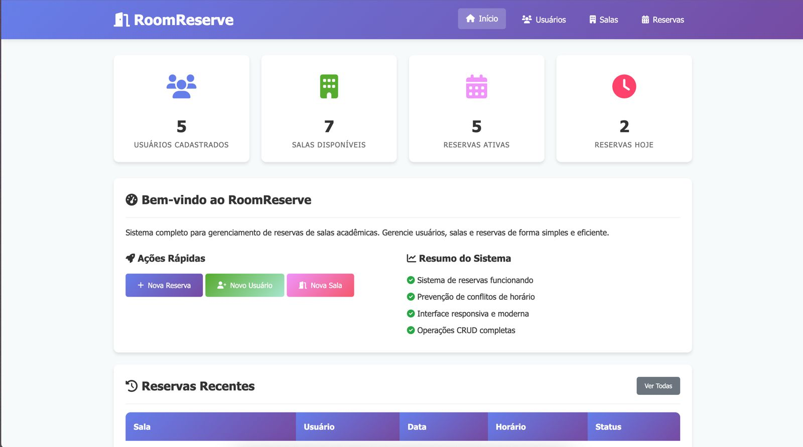
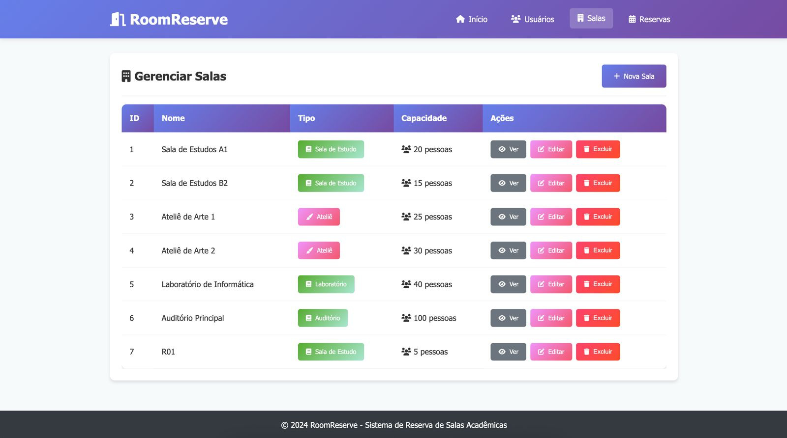
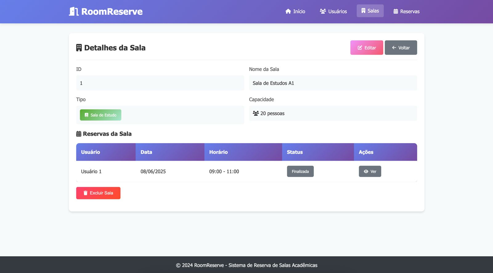
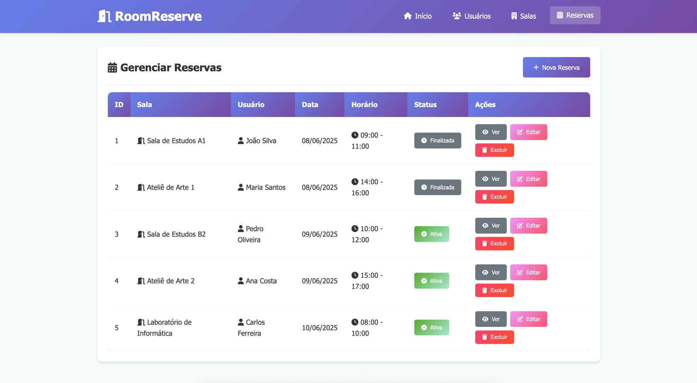

# RoomReserve - Sistema de Reserva de Salas Acadêmicas

## Descrição

RoomReserve é um sistema completo para gerenciamento de reservas de salas acadêmicas com interface web moderna e funcional. Desenvolvido com Node.js, Express e PostgreSQL, o sistema permite o gerenciamento eficiente de usuários, salas e reservas em ambiente acadêmico.

## Demonstração

[Vídeo de Demonstração](https://drive.google.com/drive/folders/1OCQVqVh5E0mYsSDLS0MvvLnaK3lnz8Vb?usp=sharing)

*Clique no texto acima para assistir ao vídeo de demonstração completa do sistema*

## Interface do Sistema

### Dashboard Principal


### Gerenciamento de Salas


### Detalhes da Sala


### Sistema de Reservas


### Funcionalidades Principais

- ✅ **Gerenciamento de Usuários**: Cadastro, edição, visualização e exclusão
- ✅ **Gerenciamento de Salas**: Diferentes tipos (Ateliê, Sala de Estudo, Laboratório, Auditório)
- ✅ **Sistema de Reservas**: Agendamento com prevenção automática de conflitos
- ✅ **Dashboard Interativo**: Estatísticas e resumo do sistema
- ✅ **Interface Responsiva**: Design moderno com CSS e JavaScript
- ✅ **Validação em Tempo Real**: Verificação de disponibilidade e validação de formulários
- ✅ **Validação Backend Robusta**: Middleware de validação com sanitização e tratamento de erros

## Tecnologias Utilizadas

- **Backend**: Node.js + Express.js
- **Frontend**: EJS (Template Engine) + CSS + JavaScript (Fetch API)
- **Banco de Dados**: PostgreSQL
- **Arquitetura**: MVC (Model-View-Controller)
- **Estilização**: CSS puro com Flexbox e Grid Layout
- **Iconografia**: Font Awesome
- **Validação**: JavaScript + Middleware Express

## Como Executar o Sistema

### Pré-requisitos

- Node.js (versão 14 ou superior)
- npm (gerenciador de pacotes)
- PostgreSQL (local ou remoto, ex: Supabase)

### Passo a Passo

1. **Clone ou baixe o projeto**

   ```bash
   git clone https://github.com/hugomontan/projeto_mod2.git
   cd projeto_mod2
   ```

2. **Instale as dependências**

   ```bash
   npm install
   ```

3. **Configure o banco de dados**

   Crie um arquivo `.env` na raiz do projeto com suas credenciais PostgreSQL:

   ```env
   DB_USER=seu_usuario
   DB_HOST=seu_host
   DB_NAME=seu_banco
   DB_PASSWORD=sua_senha
   DB_PORT=5432
   DB_SSL=true
   ```

4. **Inicialize o banco de dados**

   ```bash
   npm run init-db
   ```

5. **Popule com dados de exemplo (opcional)**

   ```bash
   npm run populate-db
   ```

   Alternativamente, execute ambos os comandos de uma vez:

   ```bash
   npm run setup-db
   ```

6. **Execute o sistema**

   ```bash
   npm start
   ```

   Para desenvolvimento com recarga automática:

   ```bash
   npm run dev
   ```

7. **Acesse no navegador**

   ```
   http://localhost:3000
   ```

## Estrutura do Projeto

O projeto segue a arquitetura MVC (Model-View-Controller) para uma organização clara e manutenção facilitada:

```
projeto_mod2/
├── assets/               # Imagens e recursos estáticos
├── config/               # Configurações (banco de dados)
├── controllers/          # Controladores da aplicação
├── middleware/           # Middleware de validação
├── models/               # Modelos de dados
├── public/               # Arquivos públicos (CSS, JS)
├── routes/               # Definição de rotas
├── scripts/              # Scripts de banco de dados
├── views/                # Templates EJS
├── .env                  # Variáveis de ambiente
├── package.json          # Dependências
├── readme.md             # Documentação
└── server.js             # Ponto de entrada da aplicação
```

## API Endpoints

O sistema oferece uma API RESTful completa para integração com outros sistemas:

### Usuários
- `GET /api/usuarios` - Listar usuários
- `POST /api/usuarios` - Criar usuário
- `GET /api/usuarios/{id}` - Buscar usuário
- `PUT /api/usuarios/{id}` - Atualizar usuário
- `DELETE /api/usuarios/{id}` - Deletar usuário

### Salas
- `GET /api/salas` - Listar salas
- `POST /api/salas` - Criar sala
- `GET /api/salas/{id}` - Buscar sala
- `PUT /api/salas/{id}` - Atualizar sala
- `DELETE /api/salas/{id}` - Deletar sala

### Reservas
- `GET /api/reservas` - Listar reservas
- `POST /api/reservas` - Criar reserva
- `GET /api/reservas/{id}` - Buscar reserva
- `PUT /api/reservas/{id}` - Atualizar reserva
- `DELETE /api/reservas/{id}` - Deletar reserva
- `GET /api/reservas/check-availability` - Verificar disponibilidade

## Validação e Segurança

O sistema implementa validação robusta em múltiplas camadas:

### Validação Backend
- **Middleware de Validação**: Validação automática de dados de entrada
- **Sanitização**: Limpeza de dados para prevenir ataques
- **Validação de Tipos**: Verificação de tipos de dados e formatos
- **Validação de Negócio**: Regras específicas (horários, datas, etc.)

### Tipos de Validação Implementados
- **Usuários**: Nome (2-255 chars), email válido e único
- **Salas**: Nome, tipo válido, capacidade positiva
- **Reservas**: IDs válidos, datas futuras, horários consistentes
- **IDs**: Números inteiros positivos
- **Datas**: Formato válido e não no passado
- **Horários**: Formato HH:MM e lógica temporal

### Tratamento de Erros
- **Códigos HTTP Apropriados**: 400, 404, 409, 500
- **Mensagens Específicas**: Detalhes claros sobre erros
- **Logs Estruturados**: Para debugging e monitoramento

### Teste de Validação
Use o arquivo `test-validation.http` para testar as validações:
```bash
# Exemplos de testes
POST /api/usuarios - com dados inválidos
GET /api/usuarios/abc - ID inválido
POST /api/reservas - data no passado
```

## Estrutura de arquivos

| Pasta/Arquivo          | Conteúdo                                  |
|------------------------|-------------------------------------------|
| **assets/**            | Arquivos estáticos                        |
| └── bdiagram.png       | Diagrama do banco de dados                |
| **config/**            | Arquivos de configuração                  |
| └── database.js        | Conexão com o banco                       |
| **controllers/**       | Controladores                             |
| ├── ReservasController.js | Lógica de controle de reservas         |
| ├── SalasController.js    | Lógica de controle de salas            |
| └── UsuariosController.js | Lógica de controle de usuários         |
| **models/**            | Modelos de dados                          |
| ├── ReservasModel.js   | Modelo de dados de reservas               |
| ├── SalasModel.js      | Modelo de dados de salas                  |
| └── usuariosModel.js   | Modelo de dados de usuários               |
| **routes/**            | Definição de rotas                        |
| ├── index.js           | Arquivo principal de rotas                |
| ├── reservas_routes.js | Rotas relacionadas às reservas            |
| ├── salas_routes.js    | Rotas relacionadas às salas               |
| └── usuarios_routes.js | Rotas relacionadas aos usuários           |
| **services/**          | Serviços auxiliares                       |
| └── userService.js     | Serviços relacionados aos usuários        |
| **scripts/**           | Scripts auxiliares                        |
| └── db.sql             | Script de criação do banco de dados       |
| **middleware/**        | Middleware de validação                   |
| └── validation.js      | Validação robusta e sanitização          |
| **Arquivos raiz**      |                                           |
| .env                   | Variáveis de ambiente                     |
| .gitignore             | Arquivos ignorados pelo Git               |
| jest.config.js         | Configuração do Jest                      |
| package-lock.json      | Dependências travadas                     |
| package.json           | Dependências do projeto                   |
| readme.md              | Documentação                              |
| rest.http              | Arquivo para testar requisições HTTP      |
| server.js              | Servidor principal                        |
| WAD.md                 | Documentação adicional (WAD)              |

## Como executar o projeto localmente

1. **Clonar o repositório:**

   ````
   git clone https://github.com/hugomontan/projeto_mod2.git
   cd Inteli-M2-Projeto-individual
   ````

2. **Instalar as dependências:**

````
 npm install 
 ````

3. **Inicie o servidor:**

````
 npm start 
 ````

## Diagrama de arquitetura


